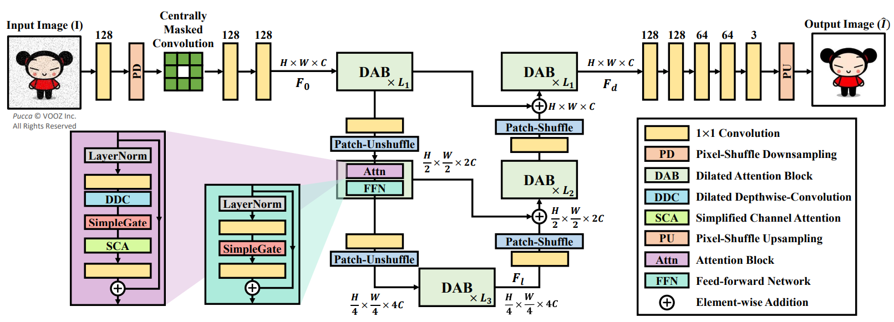
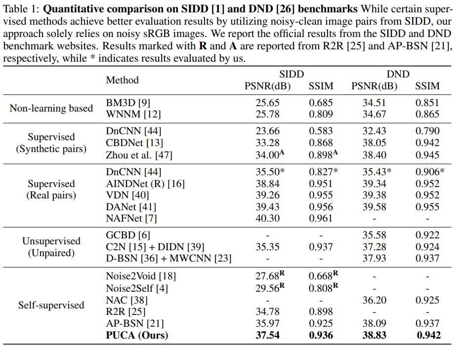
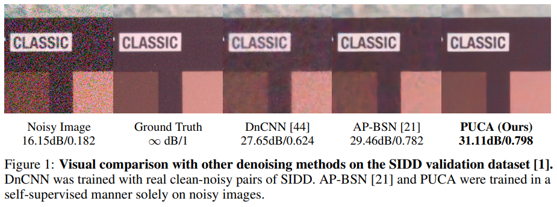
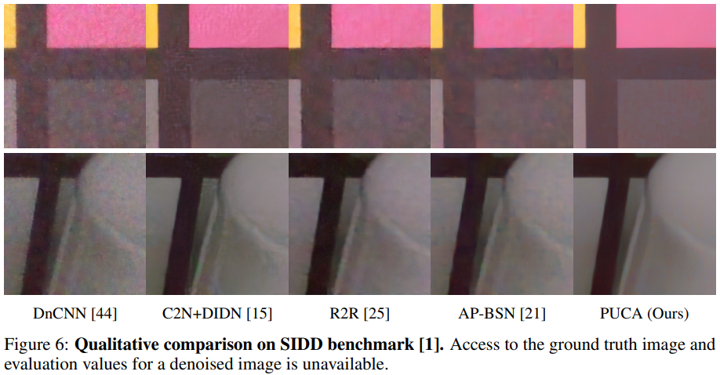

# PUCA: Patch-Unshuffle and Channel Attention for Enhanced Self-Supervised Image Denoising

This is an official PyTorch implementation of ["PUCA: Patch-Unshuffle and Channel Attention for Enhanced Self-Supervised Image Denoising"](https://arxiv.org/pdf/2310.10088.pdf) in NeurIPS 2023.




## Abstract
_Although supervised image denoising networks have shown remarkable performance on synthesized noisy images, they often fail in practice due to the difference between real and synthesized noise. Since clean-noisy image pairs from the real world are extremely costly to gather, self-supervised learning, which utilizes noisy input itself as a target, has been studied. To prevent a self-supervised denoising model from learning identical mapping, each output pixel should not be influenced by its corresponding input pixel; This requirement is known as J-invariance. Blind-spot networks (BSNs) have been a prevalent choice to ensure J-invariance in self-supervised image denoising. However, constructing variations of BSNs by injecting additional operations such as downsampling can expose blinded information, thereby violating J-invariance. Consequently, convolutions designed specifically for BSNs have been allowed only, limiting architectural flexibility. To overcome this limitation, we propose PUCA, a novel J-invariant U-Net architecture, for self-supervised denoising. PUCA leverages patch-unshuffle/shuffle to dramatically expand receptive fields while maintaining J-invariance and dilated attention blocks (DABs) for global context incorporation. Experimental results demonstrate that PUCA achieves state-of-the-art performance, outperforming existing methods in self-supervised image denoising._


---

## Setup

### Requirements

Our experiments are done with:

- Python 3.8.16
- PyTorch 2.0.0
- numpy 1.23.5
- opencv 4.7.0
- scikit-image 0.20.0

## Dataset

We follow the dataset setup in AP-BSN. Please click [this link](https://github.com/wooseoklee4/AP-BSN#directory) for detailed preparation description.

---
### Pre-trained Models

You can download pretrained checkpoints of our method. Place these files into `ckpt` folder.

| Method |      Dataset   |      Config file     | Pre-trained |
| :----: | :------------: | :------------------: | :---------: |
| PUCA |       DND      |     PUCA_DND.yaml   | [PUCA_DND.pth](https://drive.google.com/file/d/1Fct1gFOa0Pn6Y2wwlPOAuZJzwH7Y9m9E/view?usp=sharing) |
| PUCA |      SIDD      |    PUCA_SIDD.yaml   | [PUCA_SIDD.pth](https://drive.google.com/file/d/125A2kvDN-nFefialPyTxjX1tpdbGhaAL/view?usp=sharing) |


## Training & Test

### Training

```
usage: python train.py [-c CONFIG_FILE_NAME] [-g GPU_NUM] 
                       [-s SESSION_NAME] [-r] [--thread THREAD_NUM]

Train model.

Arguments:      
  -c CONFIG_FILE_NAME              Configuration file name. (only file name in ./conf, w/o '.yaml') 
  -g GPU_NUM                       GPU ID(number). Only support single gpu setting.
  -s SESSION_NAME      (optional)  Name of training session (default: configuration file name)
  -r                   (optional)  Flag for resume training. (On: resume, Off: starts from scratch)
  --thread THREAD_NUM  (optional)  Number of thread for dataloader. (default: 4)
```

You can control detail experimental configurations (e.g. training loss, epoch, batch_size, etc.) in each of config file.

Examples:

```
# Train PUCA for the SIDD dataset using gpu:0
python train.py -c PUCA_SIDD -g 0

# Train PUCA for the DND dataset with session name "MyAPBSN_DND" using gpu:0 and keep training (resume)
python train.py -c PUCA_DND -g 0 -s MyPUCA_DND -r
```

### Test

```
usage: python test.py [-c CONFIG_FILE_NAME] [-g GPU_NUM] 
(model select)        [-e CKPT_EPOCH] [--pretrained MODEL] 
                      [-s SESSION_NAME] [--thread THREAD_NUM] [--test_img IMAGE] [--test_dir DIR]

Test dataset or a image using pre-trained model.

Arguments:      
  -c CONFIG_FILE_NAME              Configuration file name. (only file name in ./conf, w/o '.yaml') 
  -g GPU_NUM                       GPU ID(number). Only support single gpu setting.
  -e CKPT_EPOCH                    Epoch number of checkpoint. (disabled when --pretrained is on)
  --pretrained MODEL   (optional)  Explicit directory of pre-trained model in ckpt folder.
  -s SESSION_NAME      (optional)  Name of training session (default: configuration file name)
  --thread THREAD_NUM  (optional)  Number of thread for dataloader. (default: 4)
  --test_img IMAGE     (optional)  Image directory to denoise a single image. (default: test dataset in config file)
  --test_dir DIR       (optional)  Directory of images to denoise.
```

You can also control detail test configurations in each of config file.

Examples:

```
# Test SIDD dataset for 20 epoch model in gpu:0
python test.py -c PUCA_SIDD -g 0 -e 20

# Test SIDD dataset for pre-trained model (./ckpt/PUCA_SIDD.pth) in gpu:0
python test.py -c PUCA_SIDD -g 0 --pretrained PUCA_SIDD.pth

# Test a image (./sample_image.png) with pre-trained SIDD PUCA in gpu:0 (image will be saved at root directory of project)
python test.py -c PUCA_SIDD -g 0 --pretrained PUCA_SIDD.pth --test_img ./sample_image.png

# Test images in a folder (./test/*)
python test.py -c PUCA_SIDD -g 0 --pretrained PUCA_SIDD.pth --test_dir ./test
```

---

## Results

### Quantitative results

Here is reported results of PUCA. Please refer our paper for more detailed results.



### Qualitative results




## Reference
```
@inproceedings{jang2023puca,
  title={PUCA: Patch-Unshuffle and Channel Attention for Enhanced Self-Supervised Image Denoising},
  author={Jang, Hyemi and Park, Junsung and Jung, Dahuin and Lew, Jaihyun and Bae, Ho and Yoon, Sungroh},
  booktitle={Thirty-seventh Conference on Neural Information Processing Systems},
  year={2023}
}
```

## Acknowledgement

The codes are based on [AP-BSN](https://github.com/wooseoklee4/AP-BSN). Thanks for their awesome works.

<!-- ---

### Update log

- (22.04.15) fixed a bug of single image test without dataset, and update test code for entire image folder.
- (22.05.13) upload result images of the SIDD validation/benchmark dataset. -->
